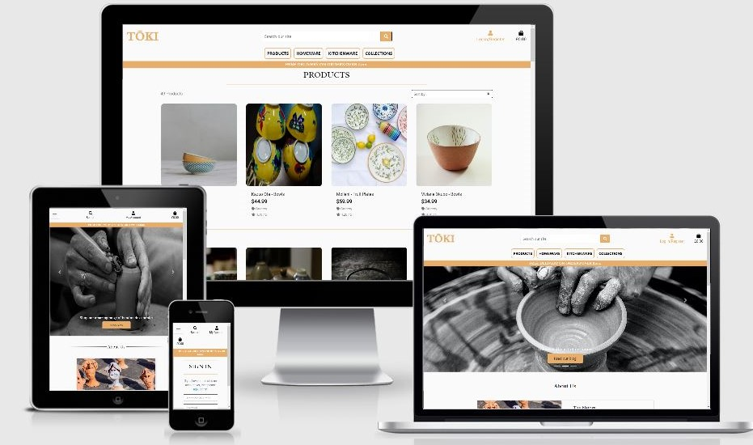
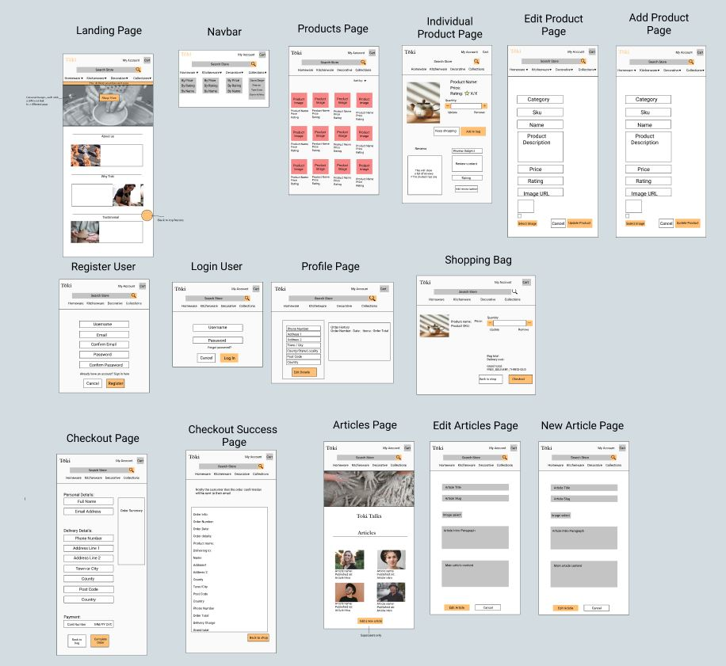
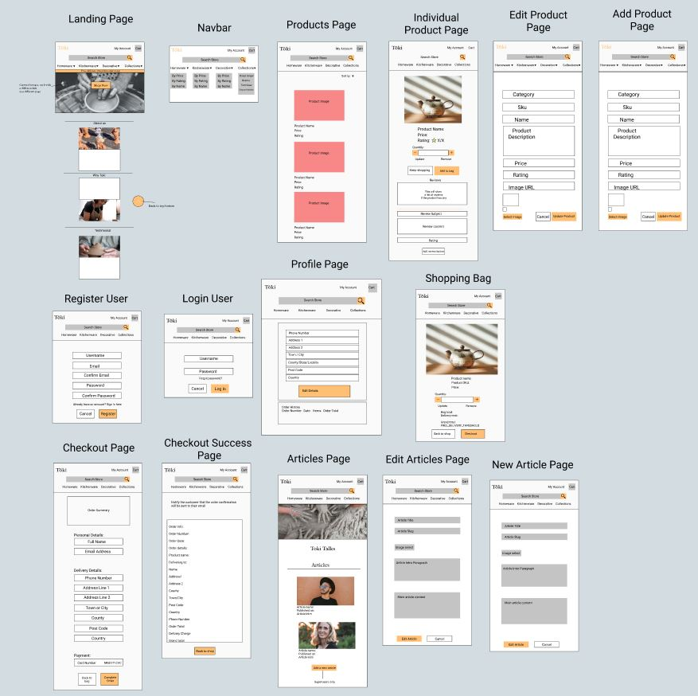
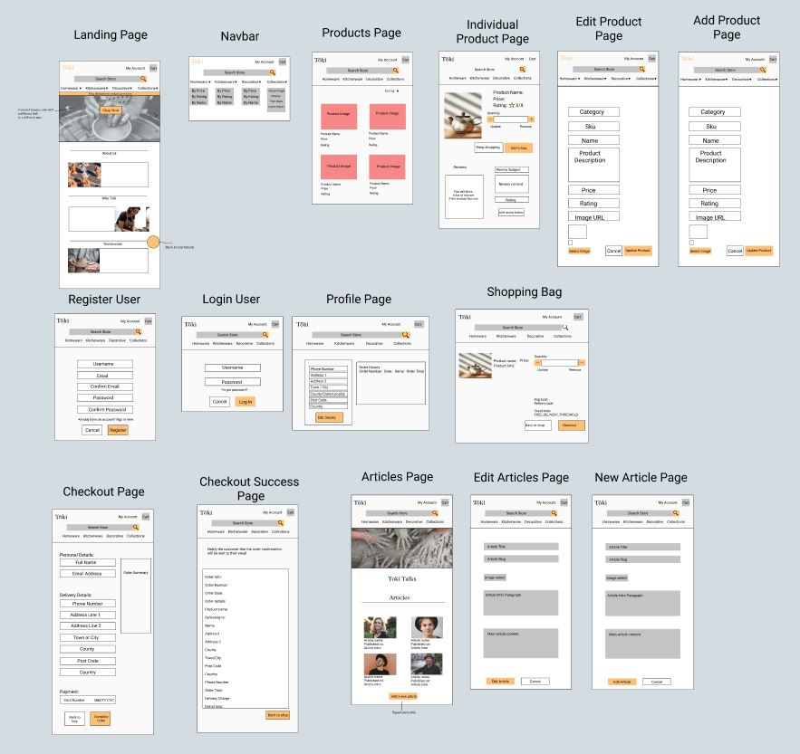

# Tōki

## Milestone Project 4

## Introduction

For my fourth milestone project I wanted to make sure to nail all of the requirements, so I set out to really understand Django and Python and how to bring them together to make an incredibly functional and responsive website.

This project posed my biggest hurdle yet, as I can admit I am not the best with backend development. So after deciding to really push myself, I set to use all of the knowledge I had gained from the mini project, and adapt this into something I could call my own.

This project also would help me with any future endeavors, as my wife has already asked for a website, and this pushed me even further.

*Tōki* is a fictional ceramics company which aims to bring world class art to everyone.

I wanted a section for articles to give users a way to explore the world of ceramics with easy to digest articles from "professionals".

The idea for Tōki was my own after recently watching, and admittedly getting very involved in, a pottery show on T.V and realising how much I like the art form.

[Live view of my project](https://toki-damsenton.herokuapp.com)

## **User Experience**

### Project aims

This project needed to be a fully functional e-commerce website using the Django framework and Python code.

The project needed a fully-functional payment system, which was achieved using Stripe.

Another challenge was image and static file hosting, but this was solved using the Amazon AWS S3 buckets, this service hosts the files remotely, and Heroku can use this to use the code for the website.

With the above in mind, I wanted to make the e-commerce website, but also make it so the page can be personal too, with reviews and articles to help keep up user engagement, and ensure that people want to keep coming back to the website.

## User stories

### Stakeholders
- The main Stakeholdersfor this website would be heavily interested in revenue generation, as this is an e-commerce website, the main goal for the company is revenue, and thanks to the bag and checkout app while also using Stripe, this was achieved.

- Stakeholders would also want to keep up user retention, to ensure traffic is high, and sales are consistent.

- The ability to review products would be great so that storeowners can see which products are more popular so they can stock more, or discontinue them.

### New users
- As a new user, I would like to find an easily navigatable webpage with a consistent colour scheme and intuitive design.

- As a new user, I would also like the option to make an account if they like the website enough.

- As a new user, I would like the ability to purchase products without being tied into making an account.

### Returning users
- As a returning user, I would want a way to see my information in my account if I make one, and edit this according to my preferences, and possible changes of name/address etc.

- As a returning user, I would liek to be able to see my order history.

- As a returning user, I would like a way to stay up to date with the company and any new stories from within the pottery world.

- As a returning customer, I would like to read or create reviews to possibly influence my purchases.

### Mobile and tablet users

- As a mobile user, I would like a responsive website that doesn't lack any features that the main desktop site has.

## Design Planes as defined by [Lauviaxh](http://donatalesiak.panel.uwe.ac.uk/wordpress/2018/10/30/the-five-planes-the-elements-of-user-experience/)

- Strategy Plane: Tōki would need to be a functional e-commerce website that appeals to a niche by using customer engagement and feedback in order to drive sales. It would also need to be able to store data for the customer should they want to create an account.

- Scope Plane: This project woudl need a robust framework in order to combine all the apps fluidly, so using Django was the most viable choice.  
Tōki needs navigation, a home view for new users, a way for users to view, add, purchase and review products. The use of an article section for customer engagement would also be useful.

- Structure Plane: After the above was decided, The structre of the webpage was decided, and the website was conceptualised. I knnew i wanted earthy tones for the colour scheme to match the pottery theme, and how the navigation bar would work, making use of dropdowns for a cleaner screen.  Use of Bootstraps grid system woul also be invaluable as this provides 'out-of-the-box' responsiveness which is vital for mobile-first development.   The structure plane also takes into account the database structure, and for this I used SQLite for development environents, and Heroku's Postgress and Amazon's AWS for deployed code. 
I wanted to break the data up into more readble chunks, so using JSON really helped with this. Having the product data split into individual products, their corresponding categories, and the reviews for each product made for much more readble code.

- Skeleton Plane: With all of the above mentioned, the way a use rwould experience this website was vital, I wanted to make the experience as seamless as possible, with a permamnet navbar that stays on the screen when scrolled made sure that a user is never just stuck on a page. 
Subtle hints from the carousel images and also the icon in the navbar encourage users to create an account, and from here, you are instantly made aware of the other features that come with this, such as delivery information and order history. 
Toasts would also prove very useful as they give instant feedback to a customer with certain inputs such as adding a product to the bag, or trying to access a page they aren't permitted to.

- Surface Plane: With all of the above mapped out, I set to work on creating the surface of the webpage. Starting with [Figma](https://www.figma.com/file/F24anz4HjMIsBDzgAt1gcy/Tōki) 
Settling on the way I would present content was a big concern, so I created my layout page by page to see how a user would like to navigate my website.

## Database Schema

For this project I had to use two different databses depending on which environment my website was in, development (SQLite) or deployed(Postgress).

With this knowledge of multiple databses, I planned out in my head how i would want this data to work with each other.

The products would need to be able to be grouped together with a common factor, so a foreign key or .category was used to tie these together, so that when filtered products with this specific category would be shown to the user.

Products would also need to compiled in one file but with multiple varibales inside it's object, so JSON was a natuarl solution for this as it is object-oriented so gives a developer a lot more freedom and improves readbility of data.

The site admin would also need to make use of both of the above databases for storing encrypted user info so that an admin can delete these should they see fit.

With all of this data, making it work together on the backend would be key to a seamless user experience.

App views and models would need to make use of the foreign keys by using Django's powerful import function which can bring in data from other apps as foreign keys to use in other views and models, this woudl help to ensure that all of this data can be used in conjunction with each other for a specific user.

## Wireframes

- Desktop wireframe

- Mobile wireframe

- Tablet wireframe

## Technologies used

- For this website, I have utilised HTML5, CSS3, JavaScript, Python, Bootstrap, JQuery, Django and Heroku

[HTML5](https://en.wikipedia.org/wiki/HTML5)

- This language is used to build the overall body of the page, from text, to page structures.

[CSS3](https://en.wikipedia.org/wiki/Cascading_Style_Sheets#CSS_3)

- CSS3 is used to style the elements on the page. CSS3 is responsible for the colour scheme, and the layout of the page.

[JavaScript](https://en.wikipedia.org/wiki/JavaScript)

- JavaScript is used to manipulate the logic of the page. I used this extensively for the Drink Matcher page.

[JQuery](https://jquery.com/)

- JQuery is a JavasCript library which allows users to use pre-written code to achieve a JavaScript goal.

[Python](https://en.wikipedia.org/wiki/Python_(programming_language))
- Python is an interpreted, high-level and general-purpose programming language. I used this for the brains of the app, making use of app routes and app views to carry out complex functions out of sight of the user.

[Django](https://en.wikipedia.org/wiki/Django_(web_framework))
- Django sometimes stylized as django is a Python-based free and open-source web framework that follows the model-template-views architectural pattern. It is maintained by the Django Software Foundation (DSF), an American independent organization established as a 501(c)(3) non-profit.

[Heroku](https://en.wikipedia.org/wiki/Heroku)
- Heroku is a cloud platform as a service (PaaS) supporting several programming languages. One of the first cloud platforms, Heroku has been in development since June 2007, when it supported only the Ruby programming language, but now supports Java, Node.js, Scala, Clojure, Python, PHP, and Go.

[Stripe](https://en.wikipedia.org/wiki/Stripe_(company))
- Stripe is an Irish-American financial services and software as a service (SaaS) company dual-headquartered in San Francisco, California and Dublin, Ireland. The company primarily offers payment processing software and application programming interfaces (APIs) for e-commerce websites and mobile applications.

[Font Awesome](https://fontawesome.com/)

- Font Awesome is a tool used to provide icons which add to the overall aesthetic of the web page.

[Google Fonts](https://fonts.google.com/)

- Google Fonts provides the user with different options for fonts to be used in web pages, further adding to the personalization of each page.

## Features and apps

### Home app
The home app would serve as the main landing page for the web page, with no models, and a simple view, the only fucntion for this app is to load the user into the first page.

This being said, once this is launched, the the base template is extended and this brings the navbar, and, the bag app and the profile app to the user.

### Products app
The product app focuses on storing data about products, and manipulating this data to display to the user.

The models for this app would be based on product informtion such as product name, details and price etc.
 
This app also allows admins of the website to create new product listings, and edit existing ones to reflect market demand.
 
When a user clicks on a product, they are taken to the product details page, here a user is able to add the product to their bag, and also make use of a quantity selctory to add multiple of each product to their bag.
 
Within the product details page, users who are logged in with an authenticated account can leave a review of a product. Thes ereviews are displayed to all users regardless of whether they have an account or not.

### Bag App
The bag app allows users to add products from the product app into their bag, this app also provides the user with what is in their bag how much their current bag costs.
 
Users are also shown how much more they need to spend in order to recieve free delivery, if this threshold is not met, then the bag app calculates 10% of the total of the contents and adds this on as a delivery charge.
 
Within the bag app, users are able to amend the contents, by either removing the product, or increasing the amount of them.

### Checkout App
The checkout app is integral to this project, as the whole point of it is the be a fully functional e-commerce website.
 
Users who purchase products also have the option to save their delivery details to their profile to make the next purchase that little bit mroe hassle-free.
 
The checkout app makes use of Stripe to handle payments, users wanting to make a purchase, can test this by using the following details; 
- Card Number: 4242 4242 4242 4242
- Postcode: 42424
- CVC 424
- Expiration: 04/24

 
Upon a successful puchase, users are given feedback in the form of a loading psinner, indicating that their payemtn is being processed.

### Profiles App
This app handles user data, and works hand in hand with the checkout app to bring a seamless experince for users who want to have a quicker checkout experience.
 
Users can update their information should they wish to.
 
Logged in users who have made purchases are shown their order history, that when clicked on, brings them to an overview of their previous purchses. 

### Articles App
The articles app makes use of a similar structure to the products app, making use of JSON files to store the articles and making use of the edit/add forms that the products app uses.
 
This app allows users to read regularly updated articles to keep up witht he industry.
 
Similar to the products app, this app gives admins the ability to create, edit and delete articles.

### Allauth
Allauth is a feature of Django that handles a wide range of user-related templates, such as the login/logout forms and also the password reset functionality.

### Emails
Upon successful account registration, users are sent an email to authenticate their account.
 
When users succesfully purchase a product, they are also sent an email with details of their purchase.

## Desired Features
With more time, I would have liked to have implemted an app for users to book onto pottery courses, making use of Google Maps API to show their nearest studio.
 
I also saw a lot of other student susing a loyalty scheme, this would also be a very desired feature for me, but with limited time, and a lack of knowledge, I was unable to complete this.

## Testing
Most of my testing was done through the use of Chrome Dev Tools to test the responsiveness of the website on smaller screens, making changes in Dev Tools allows real time alterations that you can copy over into your code.

Django comes with it's own debugger which when triggered, provides the developer with detailed error messages which make testing a lot easier. A common problem I ran into was proper use of views and models to present different pages, but with proper understanding of these error messages they were easily fixed.

All of the links for the website were manually tested by myself, these all work as intended. One problem I ran into was styling the allauth buttons, as they have set stylings, but using dev tools, I was able to figure out how to style these to fit my site.

The search bar in the naviagtion bar has been tested by inputting multiple variations of queries to ensure that it returns relevant products.

An issue for some stores is that files can be corrupted, so to ensure no broken images, a failsafe no_image.png is used in case of a broken image.

The bag app is limited to 99 of each product, to preserve website integrity. Users are also unable to add 0 of a product to the bag as this would provide an unresponsive error from the bag app, this is also the same for the chekout app, users are unable to add excess or underflow items here.

Multiple inputs have been performed to make sure that the toasts display as intended, these toasts came from the Boutique Ado mini project.
- Inputs tested:
- - Adding products to a bag - triggers a success message to let the user know what is in the bag, and gives them the option to view their bag, or head to the checkout page.
- - Accessing a forbidden URL returns an error message to let the user know they are not permitted to do this.
- - Editing a product or article will trigger a toast to let the admin know what it is they are editing.

Protecting the website's products and content would be vital for a company, so using the Django view decorator @login_required ensured that regular users of the website cannot access business critical pages such as adding/editing/deleting products.

Allauth features were tested by myself, by registering an account, logging in and logging out all successfully.

Testing automatic emails was done through account registry, and successful purchases.

## App testing

### Home
The home app was tested by myself using Chrome Dev tools to ensure the content loaded as intended, clicking on the links in the navbar worked as intended and the other apps were connected to this.

### Products
The products app was tested by navigating through the products page, cross-referencing with my .json file to ensure information was correct. 
Clicking on the product would bring up the product's details, using Chrome Dev tools would prove that this page is responsive on all screen sizes. 
Using the quantity selector showed that it is impossible to add less than 1 or more than 99 of each product, typing in the box is also prohibited past these numbers. 
I tested the creation and editing of products myself, when logged in as an admin, I could successfuly add new products, edit them, and delete them as needed.

### Bag 
The bag app was tested by adding multiple different products from multiple categories to ensure that all information is shown as intended. 
As with the products testing, the quantity selector works the same way. 
Adding in products that do not total £100 will show the user the grand total of the bag with how much more they need to spend in order to recieve free delivery, adding in items to push users over this threshold removes this alert.

### Checkout
When a user presses secure checkout, with items in their bag, they are shown to the checkout form, from here entering their details works, and using the afformentioned Stripe test details, users can complete a purchase. 
Clicking on 'save information to my profile' works as intended, and when users visit their profile, their details are pre-populated. 
Successful purchses direct users to the checkout-success page, which gives the user a breakdown of their order and their delivery details.

### Profiles
Upon registering an account, users are met with a toast to let them know they are logged in with their username. 
When accessing their account, users can view and edit their details using the form provided. 
If the user had made purchases, their order history is diaplyed on their profile.

### Articles
The articles app was tested mainlyusing Chrome Dev tools to test for responsiveness, as the functionality was mostly there from the products app, tetsing the edit/add/delete fucntinality was carried out in the same way. 

### Flake8
Using the console command python3 manage.py flake8 brings up errors in the code. 
Upon running this command, there were no critical errors, the only two errors of note were to do with lines being too long, and unused imports, but as the iports came as standard when starting an app, I did not corrct these. 
Another small error was 'avoid using null=true on charField' but I chose to keep this in as it is important for my models and views.

This website was tested on: 
- Chrome (Desktop)
- Opera (Desktop)
- Safari (iPhone, multiple versions)
- Chrome (Samsung Galaxy s21)

## Testing User Stories:

- ### New User

     i.  As a new user, I would like to find an easily navigatable webpage with a consistent colour scheme and intuitive design.
        
    * New users are met with a consistent style and an industry standard navigation bar with clear and concise wording.

    ii.  As a new user, I would also like the option to make an account if they like the website enough.
    
    * All users are able to create an account by entering their email, a preferred username, and a password that meets the webpage's passord requirements (these are clearly shown when a user enters a password with the wrong format)

    iii.  As a new user, I would like the ability to purchase products without being tied into making an account.

    * New users can browse all products, add them to a bag and purchase these in checkout without having to create an account.

- ### Returning/Frequent Users
    i. As a returning user, I would want a way to see my information in my account if I make one, and edit this according to my preferences, and possible changes of name/address etc.

    * When a user has created an account, they can go into their profile and add in their information. This information can also be saved directly to their profile when completing a purchase by checking the button at the bottom of the checkout form.

    ii. As a returning user, I would like to be able to see my order history.

    * Any user who has completed a purchase will have their order history presented to them in their profile. Clicking on the order number will take the user to a page which shows the original order confirmation screen.

    iii. As a returning user, I would like a way to stay up to date with the company and any new stories from within the pottery world.

    * All users are presented with a button in the nav bar labelled 'Blog', this takes users to a page which currently has four articles from 'industry professionals' which outline various techniques or news from the pottery world. 
    *The articles page can also be accessed from the carousel image on the home page with a button labelled 'Read Our Blog'.

    iiii. As a returning customer, I would like to read or create reviews to possibly influence my purchases.

    * Reviews for products are visible to all users of the wesbite, but only those users who have created accounts can make new reviews.

- ### Mobile and Tablet Users

    i. As a mobile user, I would like a responsive website that doesn't lack any features that the main desktop site has.

    * Mobile users have access to the same content and features as all users, the one caviat being that the nav bar is collapsed to save on screen space, but this still holds the same functionality as the desktop site, just without the same look.

## Code Validation

### HTML Validator (W3C):

### HTML Code Validation

#### Landing Page
- The landing page showed a few errors in my HTML code, such as an unpaired head tag, 'Element li not allowed as child of element nav in this context.' and a stray script tag. When searching through my code using the built in GitPod search feature, I was able to find these errors in the allauth accounts base.html in which all of these other pages was extending from.
- Other erros included img tags with no alt attributes and a h4 being the child of a span element this was easily fixed.
- Another error was to do with duplicate element ID's but as this is due to the template including the mobile-nav.html and main-nav.html, these errors have been fixed as these were extending from a base template, so removing the tags from the extended template fixed this error.
- These errors have been fixed, and each page now passes through the validator with no errors or warnings.

#### All Products Page
- There was an error due to multiple uses of the main tag, the duplicate tags have now been removed.
- This page passes validation with no errors or warnings.

#### Product Detail Page
- There was an error due to multiple uses of the main tag, the duplicate tags have now been removed.
- This page passes validation with no errors or warnings.

#### Bag Page
- There was an error due to multiple uses of the main tag, the duplicate tags have now been removed.
- This page passes validation with no errors or warnings.

#### Checkout Page
- There was an error due to multiple uses of the main tag, the duplicate tags have now been removed.
- This page passes validation with no errors or warnings.

#### Checkout Success Page
- There was an error due to multiple uses of the main tag, the duplicate tags have now been removed. 
- This page passes validation with no errors or warnings.

#### Login Page
- There was an error due to multiple uses of the main tag, the duplicate tags have now been removed.
- This page passes validation with no errors or warnings.

#### Log Out Page
- There was an error due to multiple uses of the main tag, the duplicate tags have now been removed.
- This page passes validation with no errors or warnings.

#### Profile Page
- The online validator was unable to complete this check as it does not have the permission as it is not logged in, but as this page follows the same structure as all other pages, it is safe to assume that this also passes validation.

#### Product Management Page
- There was an error due to multiple uses of the main tag, the duplicate tags have now been removed.
- This page passes validation with no errors or warnings.

#### Articles Page
- There was an error due to multiple uses of the main tag, the duplicate tags have now been removed.
- This page passes validation with no errors or warnings.

#### Individual Article Page
- There was an error due to multiple uses of the main tag, the duplicate tags have now been removed.
- This page passes validation with no errors or warnings.

#### Password Reset Pages (Allauth)
- These pages pass validation with no errors or warnings.

## CSS Validator (W3C):

### CSS Code Validation
- Using direct input into the validator showed one error which was 'Value Error : font-size Unknown dimension 1rerem' this was a very quick fixed, and has been rectified.

### CSS URI Validation
- Validating through W3C's URI validator showed 'Property text-decoration-skip-ink doesn't exist &	.accordion	Property overflow-anchor doesn't exist' across all pages. As these are built-in Bootstrap classes, I will not be editing these.

## JavaScript Validator (JSHint)

### JavaScript Errors
- Using JSHint, there were no erros in my JavaScript, only warnings based on ES6 not being recognised by the validator.

### Python Validator (Extendsclass.com)
- This validator only returned errors on my f' strings as this is not recognised by this validator.
- All python code meets PEP8 compliance.

## Project Deployment

My project was created exclusivley in GitPod and using Git Version Control, I was able to periodically commit and push my code to GitHub.

This project is also hosted on Heroku, and using automatic deployments from GitHub, this is a mirror of my original code.

- To start this project, I had to create a GitHub profile, I then created a new repository using the on-screen instructions. When setting up my repository,

- I utilized the Code Institute template which provides basic boiler text.

- Once my code was written, and pushed to GitHub, I opened up my GitHub profile and navigated to the settings in my repository.

- From the settings, I scrolled down to the GitHub Pages section and selected the _Master Branch_ source.

- With these settings confirmed, the page is now live on GitHub Pages, and free to view by all in a web browser.

- In the CLI(Command Line Interface) I Installed Django, and all of my subsequent requirements using pip3 install Django.

- From here I used 'python3 manage.py startapp toki' to create my first app, which installed all of the relevant python files ready for use. This method was also used to install of the apps in the workspace. 

- When my code was halfway done, I connected my workspcae to Heroku.

- I created a Heroku account by first navigating to [Heroku](https://dashboard.heroku.com/apps), and creating an account. From here, I selected create a new app, and this brought me to create an app name and select the region for it's hosting.
From here, I entered in my GitHub details and linked the account.
In the app settings, perhaps one of the most important parts of this project, I entered in multiple variables into the section labelled 'config vars'. These config vars are hidden from any code pushed to GitHub and Heroku unless you are the owner of the repository. These config vars are essential to the connection between my app and Amazon AWS, utilizing my website secret keys, stripe secret keys, AWS secret keys and 

- Once my repository was created on GitHub, I was able to link this to my Heroku profile.

- Once connected to Heroku, I created an Amazon AWS account in order to create an S3 bucket.

- To do this, I created my account, navigated to S3, created a bucket, then I had to create a policy for this bucket, create a group for this bucket then add users into this.

- Once set up, I downloaded the .csv file which contained the secret keys needed to link this bucket to my project, the added these into my Heroku config vars.

- Any users wishing to view this code, or if they would like to use it for inspiration, they can do so on [My GitHub Page](https://github.com/DamSenton/Toki)

## Content

All content for this website is fictional, and was written by myself for creative and scholastic purposes.

The images for the website were taken from [Unsplash](https://unsplash.com). All of these images are extremely high quality and free to use.

## Code

The code for this project was heavily inspired by Boutique Ado, as all of the apps are integral to an e-commerce website, and "there is no need to re-invent the wheel" springs to mind, this being said, I took it upon myself to style the website to avoid too many similarities, and to put my own personal spin on things.

Most of the rest of the code for this project was written by myself, however, as stated in code comments in my style.css file, the back-to-top button was provided by [Heather Tovey](https://heathertovey.com/blog/floating-back-to-top-button).

For extra style accross the page, I opted to use a new block divider, this was free to use from [Codepen.Io](https://codepen.io/stg/pen/ZYYQMJ)

I took inspiration from previous projects and used old code such as card elements and footer icons.

My Articles app was inspired by [Valentina-B](https://github.com/valentina-b/ecosio-eco-friendly-cosmetics) and customised by myself to change stylings, variable names, and object data.

The ProductReview code was inspired by [Vlaodprea](https://github.com/vladoprea/dream-woollies) and edited by myself to better fit my website's style.

## Special Thanks

A huge thankyou to Code Institute for giving me this opportunity to learn this craft over the last year, while it hasn't always been easy or even enjoyable at points, it has always been worth it.

A thankyou to my mentor Seun Owonikoko for her undivided support and inspiration, her suggestion for an article app really helped to tie this project together.

A big thank you to my wife for her unlimited support through the late nights of me coding, and the subsequent stress of project deadlines.

And congratulations to my past self for taking on this huge challenge and actually sticking to it.

Sam.
